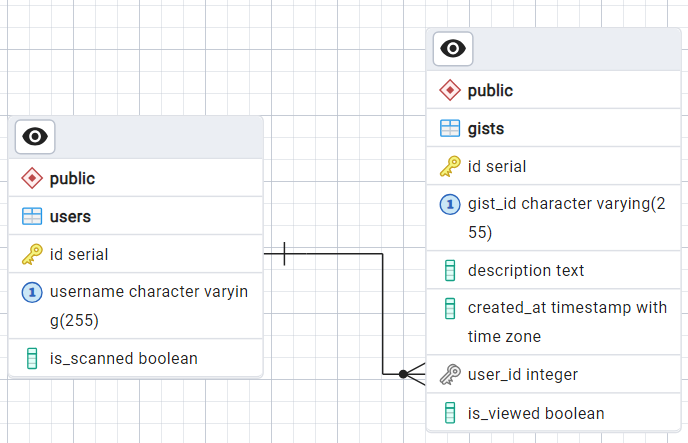

# GitHub Gists to Pipedrive
To run this application locally, first clone this repository and ensure you have Docker installed on your machine. Once cloned, open a terminal in the project directory (in /pi-app) and run the following command:
```sh
docker-compose up -d
```
This will create a PostgreSQL database, run migrations to create tables and seed some data, and start the application on http://localhost:8080.

This app has four API endpoints:

- GET: /fetch-gists (on cloud: https://pi-app-n5btuly27q-ew.a.run.app/fetch-gists)
- GET: /new-gists (on cloud: https://pi-app-n5btuly27q-ew.a.run.app/new-gist)
- GET: /scanned-users (on cloud: https://pi-app-n5btuly27q-ew.a.run.app/scanned-users)
- POST: /add-user (on cloud: https://pi-app-n5btuly27q-ew.a.run.app/add-user)

1. The "GET: /fetch-gists"
- Used for periodic checks, this endpoint returns fresh gists and adds them to Pipedrive deals. If a client requests this endpoint multiple times, it will not add already-added gists to Pipedrive deals; it will just return them to avoid duplicates. A Google Cloud Scheduler job is set up for this endpoint, which makes a request every 3 hours to fetch new gists and add them to Pipedrive deals if they haven't been added already.

2. The "GET: /new-gists" 
- Returns fetched gists that have been added to Pipedrive deals. If a client requests this endpoint multiple times, the client won't see gists that have already been returned in previous requests, ensuring that only new and unviewed gists are shown.

3. The "GET: /scanned-users"
- Returns scanned users. If some users have new gists, the /fetch-gists endpoint will still scan them and add the gists to Pipedrive deals.

4. The "POST: /add-user"
- Added for testing purposes, this endpoint allows a client to provide a GitHub username. When the client requests the "/fetch-gists" endpoint, any new gists from the added user will also be scanned.

    Example of adding a user:
    ```
    Headers: Content-Type:application/json
    Body: 
    {
        "username": "user1"
    }
    ```

### Database structure


users
- id: Auto-incremented primary key
- username: GitHub username of the user
- is_scanned: Flag indicating whether the user has been scanned

gists
- id: Auto-incremented primary key
- gist_id: ID of the gist on GitHub
- description: Description of the gist on GitHub
- created_at: Datetime when the gist was created on Github
- user_id: Foreign key
- is_viewed: Flag indicating if the client has already seen this gist. When a GET request is made to the /new-gists endpoint, is_viewed is set to true.

## Cloud
For deploying this app, Google Cloud was used.
Link to the REST API: https://pi-app-n5btuly27q-ew.a.run.app/

The following commands were used for deployment:

```
docker build --no-cache --platform linux/amd64 -t gcr.io/pi-app-project/pi-app:latest .
```

```
docker push gcr.io/pi-app-project/pi-app:latest
```

```
gcloud run deploy pi-app --image gcr.io/pi-app-project/pi-app:latest --platform managed --region europe-west1 --allow-unauthenticated --set-env-vars GITHUB_TOKEN=your_github_token,PIPEDRIVE_API_TOKEN=your_pipedrive_token,POSTGRES_USER=postgres,POSTGRES_PASSWORD=your_password,DB_HOST=your_db_host,DB_PORT=5432,POSTGRES_DB=your_db
```
Using --set-env-vars, you can set environment variables used in the project, ensuring that sensitive data is not exposed in GitHub.

This application uses Google Cloud SQL for the PostgreSQL database, which was set up by the author.

### Google Cloud Scheduler job
For periodic checks, Cloud Scheduler was used to send GET requests to the "/fetch-gists" endpoint, which adds gists to Pipedrive deals.

Command for creating a job:

```
gcloud scheduler jobs create http fetch-gists --schedule "0 */3 * * *" --http-method GET --uri "https://pi-app-n5btuly27q-ew.a.run.app/fetch-gists" --time-zone "Etc/UTC" --project "pi-app-job" --location "us-central1"
```

### Continuous Deployment with GitHub Actions
This project uses GitHub Actions to automate the deployment process. On every push to the main branch, GitHub Actions will build and deploy the application to Google Cloud Run. This ensures that any changes made to the code are automatically deployed, provided they pass the build and validation steps.
You can find Github actions for this project here: https://github.com/ahabdu01/pi-app/actions/

### Logging with Winston
This application uses the Winston library for logging. Winston is a versatile logging library for Node.js that allows you to create logs at various levels (e.g., info, warn, error) and output them to different transports (e.g., console, files).

- Logs are output to the console, making it easy to monitor the application in real-time. This is particularly useful during development and debugging.

- Logs are also saved to a file named app.log located in the root directory of the project. The log entries include a timestamp, the log level, and the log message.

### Tech stack
- Node.js
- PostgreSQL
- Express.js
- Docker
- Google Cloud